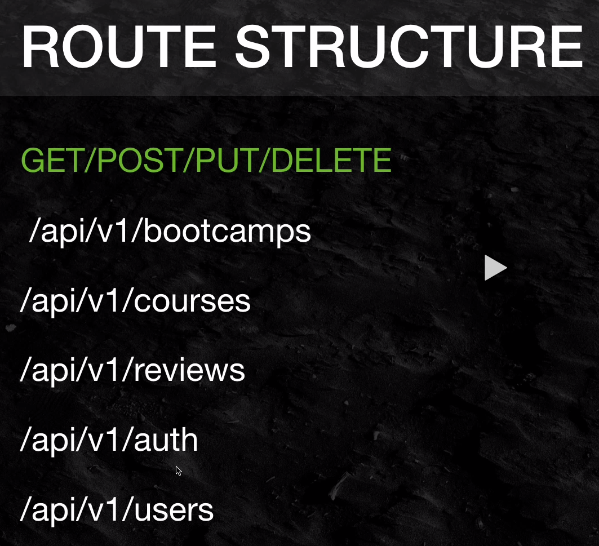

# NodeJS API + Express + MongoDb Masterclass

## Seção 1 - Welcome to the course

- Visão geral sobre o conteúdo do curso
- Apresentação do projeto final
- Configuração de ambiente

## Seção 2 - HTTP Intro - Headers, Body, Status Codes, etc...

Introdução ao Node, instalação do Nodemon, respondendo com status codes

## Seção 3 - Starting our DevCamper Projetc

Seção onde realmente se inicia a codificação do projeto.
Os [recursos](devcamper_project_resourcer) dessa seção contém as especificações, links para as bibliotecas utilizadas e os templates HTML. Esses templates serão usados apenas para referência, tendo em vista que o foco do treinamento é a criação de API

Cada rota representa um 'resource'
A ideia de usar '/api/v1' antes de cada resource é versionar a API, de forma que é possível atualizar
ou criar novas versões da API sem afetar o funcionamento da atual

## Seção 4

## Seção 5

## Seção 6

## Seção 7

## Seção 8

## Seção 9

## Seção 10

## Seção 11
